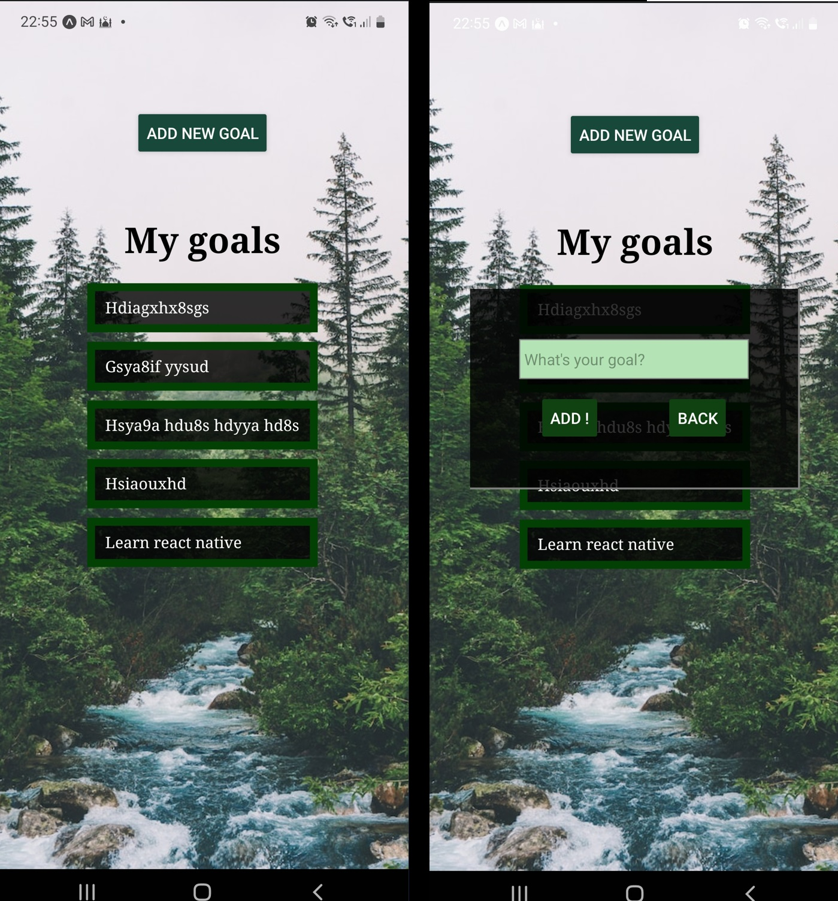

# React Portfolio 

## Table of content
- [Installation](#Installation)
- [Usage](#Usage)
- [License](#License)
- [Questions](#Questions)
## Description
This is my firs app created in react-native. It is simple app where you can add and delete list of goals. 
It is aimed for an Android as I do not own any iOS device,
## Screenshot

### While working on this app I learned
- How to use react-native with expo go
- Basics of react-native and its differences with react for webDev
- Begin learning how to effectively style react-native components and its differences with CSS
- Basically almost everything while doing this app was new to me (elements, animations with probs)
## Installation
Will need to run npm install and get Expo go to run this app in phone.

## License
GNU General Public License v3.0 is used on this project.
## Future development
I want to add async storage to save the list items  for later, but will do so after learning more of react-native.

## Questions
If you have any more questions for the project you can always contact me on my [email](mailto:tiskarechk@gmail.com).  
[HERE](https://github.com/FrantiskaAli) is link to my github account. 